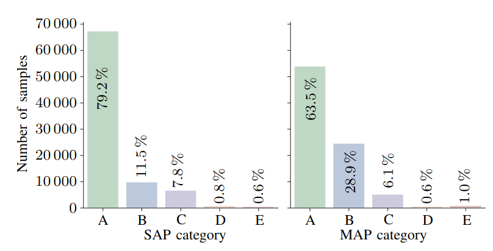

# In Vivo Data-Driven Aortic Pressure Estimation from Electrical Impedance Tomography

This branch contains the code related to the paper *TBD* for predicting systolic arterial pressure (SAP), mean arterial pressure (MAP),
and diastolic arterial pressure (DAP) using electrical impedance tomography (EIT) measurements.

<!--
## Results - preview

    

    <em><b>Figure 2:</b> Risk zones histogram defined by [1] for SAP and MAP of the full cross-validation.</em>

-->

