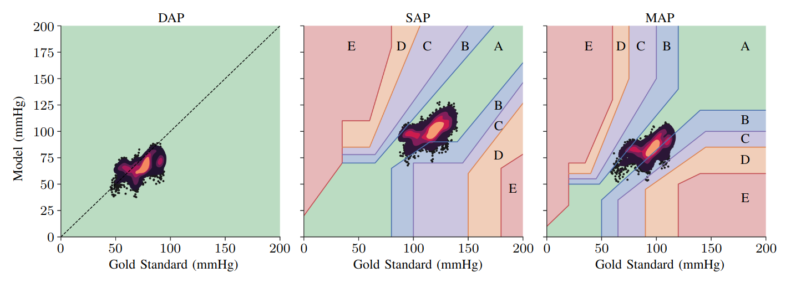

# In Vivo Data-Driven Aortic Pressure Estimation from Electrical Impedance Tomography

This branch contains the code related to the paper *TBD* for predicting systolic arterial pressure (SAP), mean arterial pressure (MAP),
and diastolic arterial pressure (DAP) using electrical impedance tomography (EIT) measurements.

## Results - preview

    

    <em><b>Figure 1:</b> Scatterplots of the DAP, SAP, and MAP prediction of the test data from pig ten, trained on all nine augmented pig data set samples.
    The color map refers to the risk gradient for non-invasively estimated blood pressures as suggested by [1]. 
    A KDE heatmap presents overlapping data points in the scatter plots in four steps, from purple to orange, in each step in 20% steps.</em>

    

    <em><b>Figure 2:</b> Risk zones histogram defined by [1] for SAP and MAP of the full cross-validation.</em>

___

## Hyperparameter tuning - hisotry

**DATA:**  `load_path = "/data/PulHypStudie_Check_npz_SNR30/"`

| model | epochs| batch_size| kernels| filters| adam| loss|
|---|----|-----|----|-----------|------|------|
| 1 | 30 |  64,|  3 | [8, 4, 2] | adam |  mae |
| 2 | 30 |  64,|  4 | [8, 4, 2] | adam |  mae |
| 3 | 30 |  64,|  5 | [8, 4, 2] | adam |  mae |
| 4 | 40 |  64,|  6 | [8, 4, 2] | adam |  mae |
| 5 | 50 |  64,|  7 | [8, 4, 2] | adam |  mae |
| 6 | 50 |  64,|  8 | [8, 4, 2] | adam |  mae | 
| 7 | 50 |  64,|  9 | [8, 4, 2] | adam |  mae |
| 8 | 30 |  64,|  3 | [8, 4, 2] | adam |  mse |
| 9 | 30 |  64,|  4 | [8, 4, 2] | adam |  mse |
|10 | 30 |  64,|  5 | [8, 4, 2] | adam |  mse |
|11 | 40 |  64,|  6 | [8, 4, 2] | adam |  mse |
|12 | 50 |  64,|  7 | [8, 4, 2] | adam |  mse |
|13 | 50 |  64,|  8 | [8, 4, 2] | adam |  mse |
|14 | 50 |  64,|  9 | [8, 4, 2] | adam |  mse |
|15 | 30 |  48,|  9 | [8, 4, 2] | adam |  mse |
|16 | 40 |  32,|  9 | [8, 4, 2] | adam |  mse |
|17 | 50 |  16,|  9 | [8, 4, 2] | adam |  mse |
|18 | 50 |  8, |  9 | [8, 4, 2] | adam |  mse |
|19 | 50 |  4, |  9 | [8, 4, 2] | adam |  mse |
|20 | 50 |  2, |  9 | [8, 4, 2] | adam |  mse |
|21 | 50 |  512|  8 | [8, 4, 2] | adam |  mae | 
|22 | 50 |  256|  8 | [8, 4, 2] | adam |  mae | 
|23 | 50 |  128|  8 | [8, 4, 2] | adam |  mae | 
|24 | 50 |  32,|  8 | [8, 4, 2] | adam |  mae | 
|25 | 50 |  16,|  8 | [8, 4, 2] | adam |  mae | 
|26 | 50 |  8, |  8 | [8, 4, 2] | adam |  mae | 

**DATA:**  `load_path = "/data/PulHypStudie_Check_npz_SNR20/"`

| model | epochs| batch_size| kernels| filters| adam| loss|
|----|----|-----|----|-----------|------|-----|
| 27 | 50 | 64  | 3  | [8, 4, 2] | adam | mae |
| 28 | 50 | 64  | 4  | [8, 4, 2] | adam | mae |
| 29 | 50 | 64  | 5  | [8, 4, 2] | adam | mae |
| 30 | 50 | 64  | 6  | [8, 4, 2] | adam | mae |
| 31 | 50 | 64  | 7  | [8, 4, 2] | adam | mae |
| 32 | 50 | 64  | 8  | [8, 4, 2] | adam | mae | 
| 33 | 50 | 64  | 9  | [8, 4, 2] | adam | mae |
| 34 | 50 | 64  | 3  | [8, 4, 2] | adam | mse |
| 35 | 50 | 64  | 4  | [8, 4, 2] | adam | mse |
| 36 | 50 | 64  | 5  | [8, 4, 2] | adam | mse |
| 37 | 50 | 64  | 6  | [8, 4, 2] | adam | mse |
| 38 | 50 | 64  | 7  | [8, 4, 2] | adam | mse |
| 39 | 50 | 64  | 8  | [8, 4, 2] | adam | mse | 
| 40 | 50 | 64  | 9  | [8, 4, 2] | adam | mse | 

## Cross-validation

Taking the best model from the hyperparameter tuning 

*model 40: epochs = 50, batch_size = 64, kernels = 9, filters = [8, 4, 2], opt = adam, loss = mse*

A total of 15 cross-validations were calculated. Some parameters were re-tuned to find the best model for different subjects.

-  cross_validation_1 : PulHypStudie_Check_npz_SNR20
-  cross_validation_2 : PulHypStudie_Check_npz_SNR30
-  cross_validation_3 : PulHypStudie_Check_npz_v2_SNR30
-  cross_validation_4 : PulHypStudie_Check_npz_v2_SNR40
-  cross_validation_5 : PulHypStudie_Check_npz_v2_SNR40 ->mae
-  cross_validation_6 : PulHypStudie_Check_npz_v2_SNR30 ->mae
-  cross_validation_7 : PulHypStudie_Check_npz_v2_SNR10 ->mse
-  cross_validation_8 :PulHypStudie_Check_npz_v2_SNR40-
-  cross_validation_9 :PulHypStudie_Check_npz_v2_SNR40->mae,bs=16,e=60
-  cross_validation_10 :PulHypStudie_Check_npz_v2_SNR30->mae,bs=16,e=60
-  cross_validation_11 :PulHypStudie_Check_npz_v2_SNR10->mse,bs=16,e=60
-  cross_validation_12 :PulHypStudie_Check_npz_v2_SNR10->mae,bs=16,e=70
-  cross_validation_13 :PulHypStudie_Check_npz_v2_SNR20->mae,bs=16,e=70
-  cross_validation_14 :PulHypStudie_Check_npz_v2_SNR30->mae,bs=16,e=70
-  cross_validation_15 :PulHypStudie_Check_npz_v2_SNR40->mae,bs=16,e=70

**Resources**

[1] Saugel, B., Grothe, O., & Nicklas, J. Y. (2018). Error grid analysis for arterial pressure method comparison studies. Anesthesia & Analgesia, 126(4), 1177-1185.
